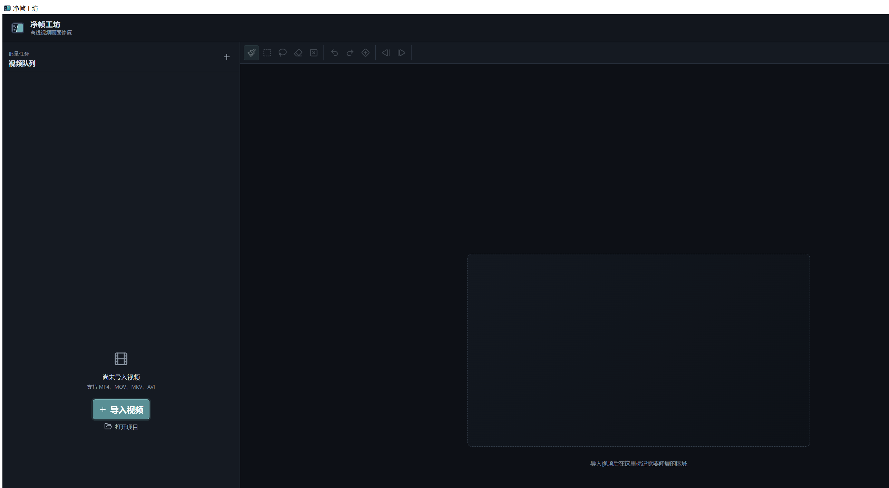

<div align="center">
  
  <h1>净帧工坊</h1>
  <p>Windows 离线视频画面修复工具</p>
  <p>标记画面中不需要的文字、标记、遮挡物或移动物体，检查跟踪结果，再导出干净视频。</p>

  [](https://github.com/CommonerOfWestWall/jingzhen-workshop/actions/workflows/ci.yml)
  [](LICENSE)
  [](#运行要求)
  [](#隐私与使用范围)
  [](https://github.com/CommonerOfWestWall/jingzhen-workshop/releases)

  [获取软件](#获取软件) · [三分钟上手](#三分钟上手) · [完整使用说明](使用说明.md) · [验证记录](docs/validation-matrix.md)
</div>



> [!IMPORTANT]
> 净帧工坊目前是 **0.1 预览版**。基础 CPU 修复、固定区域、移动跟踪、透明度变化、批量队列和可选 NVIDIA 加速均已实现；仍有明确的[版本边界](#当前版本边界)。请先用短片预览确认效果，再处理重要素材。

## 它能做什么

- **固定区域**：处理位置不变的角标、字幕、贴纸和遮挡物。
- **移动目标**：在关键帧标记目标，由双向光流与仿射跟踪传播掩膜；低置信区间会显示在时间轴上，便于补充修正点。
- **透明度变化**：保持完整覆盖范围，避免图案变淡或短暂消失时掩膜跟着跳变。
- **组合处理**：同一个视频可以同时保留固定层和移动层，一次导出完成修复。
- **批量复用**：同分辨率、同方向的一批视频，可把一个固定选区应用到整批。

修复在本机完成。程序自带 FFmpeg/ffprobe，支持竖屏素材、项目保存、安全取消、唯一输出命名，并尽量保留兼容的音频、文本字幕和必要元数据。

## 获取软件

### 普通用户

1. 从 [Releases 页面](https://github.com/CommonerOfWestWall/jingzhen-workshop/releases) 下载最新预览版的 `净帧工坊-免安装版.zip` 和同名 `.sha256` 文件。
2. **完整解压** ZIP，不要只把 EXE 单独拖出来。
3. 可选：按发布页说明核对 ZIP 的 SHA-256，确认下载完整。
4. 双击 `净帧工坊.exe`。无需安装，也不需要管理员权限。

公开版本会标记为 **Pre-release（预览版）**。ZIP 内还包含 `SHA256SUMS.txt`，用于检查主程序、引擎、模型和 FFmpeg 等内部文件。只从本仓库 Releases 下载，不要使用不明第三方链接。

### 运行要求

- Windows 10/11 x64，系统 WebView2 可用。
- CPU 模式开箱即用；高清视频处理会比较慢。
- NVIDIA GPU 加速为可选组件。兼容设备可在软件内点击安装，支持暂停、继续和完整性校验。
- 所有视频分析和修复均离线进行；只有用户主动安装 GPU 组件时需要联网下载运行库。

## 三分钟上手

1. 点击 **导入视频**，在左侧队列选中一个任务。
2. 定位到目标清晰可见的一帧，用矩形、画笔或套索标记需要修复的区域。
3. 在右侧选择范围策略：固定不动选 **固定区域**，位置变化选 **移动目标**，位置固定但时隐时现选 **透明度变化**。
4. 移动目标点击 **开始跟踪**；检查时间轴上的低置信提示，必要时在关键帧修正后重新跟踪受影响区间。
5. 点击 **生成预览**，用眼睛按钮对比原片和修复结果。
6. 选择 H.264 或 H.265、质量和输出帧率，点击 **导出视频**。

| 看到的情况 | 应选策略 |
| --- | --- |
| 目标从头到尾位置不变 | 固定区域 |
| 目标在画面内移动、缩放或旋转 | 移动目标 |
| 目标位置基本不变，但透明度周期变化 | 透明度变化 |
| 左上角固定标记 + 右下角移动标记 | 先保留固定层，再标记移动目标 |

更详细的关键帧修正、批量处理、补帧、导出和故障排查见 [《使用说明》](使用说明.md)。

## 设计重点

- **不是模糊遮盖**：高清模式使用 LaMa 修复模型重建选区内容；快速草稿只用于检查范围，不代表最终质量。
- **选区按时间传播**：移动目标使用双向跟踪生成逐帧掩膜，并把低置信区间交给用户检查；高清修复不是简单模糊覆盖。
- **AI 视频兼容**：检测可变帧率，可保留全部解码帧并按目标帧率重建时间轴；支持用户输入 1–120 fps。
- **不静默破坏素材**：检测到当前版本无法安全处理的 HDR、10/12-bit 或复杂旋转元数据时会警告或阻止导出。
- **任务互不拖累**：单个任务失败不会清空其他队列项；取消会在当前安全处理单元结束后停止。

## NVIDIA GPU 加速

基础免安装包不强迫所有用户携带数 GB CUDA 运行库。检测到兼容的 NVIDIA 显卡后，右侧会出现 **安装 NVIDIA GPU 加速**：

- 下载约 2.0 GB，安装前需要约 4.5 GiB 可用空间。
- 文件保存到软件目录内，不修改系统 CUDA、PATH 或注册表。
- 下载支持暂停和断点续传，安装前核对文件大小和 SHA-256。
- 只有真实 LaMa 模型通过 CUDA 自检后，界面才会显示 **GPU 加速已启用**。
- 安装失败时仍可继续使用 CPU 模式。

具体许可证见 [GPU 组件说明](licenses/GPU-COMPONENT-LICENSES.md)。公开实测数据见 [验证记录](docs/validation-matrix.md)。

## 当前版本边界

| 已实现并验证 | 尚未完成或仍需扩大验证 |
| --- | --- |
| 固定、移动、透明度变化三种策略 | SAM 2 尚未集成，移动目标目前使用双向光流/仿射传播 |
| 横屏、竖屏、24/25/30/60 fps 样片 | HDR、10/12-bit 和复杂旋转元数据以阻止或警告为主 |
| 单音轨、多音轨、文本字幕映射 | 图形字幕和更多容器组合仍需扩大覆盖面 |
| H.264/H.265、VFR 兼容模式 | 已知模板的尺度、旋转与透明度联合估计尚未完成 |
| CPU 便携运行和 RTX 5070 Ti CUDA 自检 | 其他 NVIDIA 型号和不同显存档位尚未全面实测 |

当前“高清修复”使用 LaMa 对跟踪后的逐帧掩膜进行重建，还不是 ProPainter 一类端到端时序生成模型；复杂运动、人物细节和从未露出的背景仍可能出现闪烁或推测错误。这个限制不能靠文案掩盖，必须以实际预览结果为准。

ProPainter 与 E2FGVI-HQ 的上游许可证限制非商业使用，因此不随本项目发行版分发。当前可分发修复路径使用 Apache-2.0 的 OpenCV LaMa 模型。来源与许可核对见 [模型研究](docs/research/upstream-models.md)。

## 从源码运行

需要 Windows、Rust、Node.js 24、Python 3.12、WebView2 和 FFmpeg。

```powershell
git clone https://github.com/CommonerOfWestWall/jingzhen-workshop.git
cd jingzhen-workshop

npm ci
python -m venv engine\.venv
.\engine\.venv\Scripts\python.exe -m pip install -e ".\engine[dev]"
npm run tauri -- dev
```

<details>
<summary><strong>测试与免安装版构建</strong></summary>

```powershell
# Python
cd engine
.\.venv\Scripts\python.exe -m pytest -q

# 前端和 Rust
cd ..
npm test -- --run
npm run build
cd src-tauri
cargo fmt --all -- --check
cargo test
cd ..

# 下载并校验 CPU 模型
.\scripts\download_models.ps1

# 构建 Python sidecar
cd engine
.\.venv\Scripts\pyinstaller.exe --clean --noconfirm jingzhen-engine.spec
.\.venv\Scripts\pyinstaller.exe --clean --noconfirm lama-frame-engine.spec
.\.venv\Scripts\pyinstaller.exe --clean --noconfirm lama-gpu-launcher.spec
cd ..

# 构建 Tauri Release 和免安装 ZIP
npm run tauri -- build --no-bundle
.\scripts\build_portable.ps1
.\scripts\package_portable_zip.ps1
```

FFmpeg Windows 目录默认是 `C:\ffmpeg`，也可先设置 `JINGZHEN_FFMPEG_ROOT`。目录必须包含 `bin/ffmpeg.exe`、`bin/ffprobe.exe`、`LICENSE` 和 `README.txt`。

不要用普通 `cargo build --release` 的产物直接封装。打包脚本会检查生产前端是否真正内嵌，避免 EXE 错误打开开发服务器地址。

</details>

## 项目结构

| 目录 | 内容 |
| --- | --- |
| `src/` | React/TypeScript 编辑界面 |
| `src-tauri/` | Rust/Tauri 文件管理、队列、进度、FFmpeg 与 GPU 组件管理 |
| `engine/` | Python/OpenCV/ONNX Runtime sidecar 与 PyInstaller 配置 |
| `models/` | 模型清单；模型二进制不提交到 Git |
| `scripts/` | 下载、检查和免安装版打包脚本 |
| `docs/` | 验证记录、研究结论和界面资料 |

## 隐私与使用范围

净帧工坊不会上传视频。请只处理自己拥有或已经获得授权的素材，不要用它侵犯他人的著作权、商标权或隐私权。

项目代码采用 [Apache-2.0](LICENSE)。FFmpeg、模型、ONNX Runtime 和 NVIDIA 组件保留各自许可证，详情见 [`licenses/`](licenses/)。

## 参与项目

- 使用问题或缺陷：[提交 Issue](https://github.com/CommonerOfWestWall/jingzhen-workshop/issues)
- 参与开发：[CONTRIBUTING.md](CONTRIBUTING.md)
- 安全问题：[SECURITY.md](SECURITY.md)
